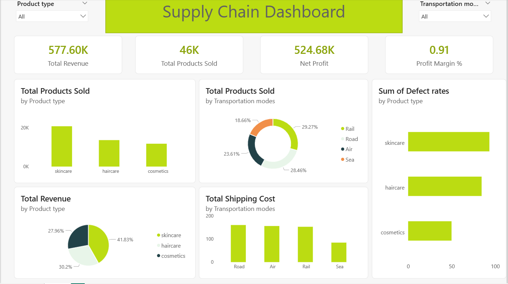

# 🚚 Supply Chain Dashboard — Power BI

A single-page Power BI report that turns raw, product-level supply chain data into a KPI dashboard covering revenue, profitability, sales volume, transportation cost, and product quality (defect rates) — filterable by product type and transportation mode.

---

## 📸 Dashboard



**KPI cards:** Total Revenue (577.60K) · Total Products Sold (46K) · Net Profit (524.68K) · Profit Margin % (0.91)

**Visuals:**
- Total Products Sold — by Product type (column chart)
- Total Products Sold — by Transportation mode (donut chart)
- Sum of Defect Rates — by Product type (bar chart)
- Total Revenue — by Product type (pie chart)
- Total Shipping Cost — by Transportation mode (column chart)

**Filters:** Product type slicer, Transportation modes slicer — both drive every visual and KPI card on the page.

---

## 🧱 Data Model

The report is built on a single table, **`supply_chain_data`**, at the individual product/shipment level. Key fields used across the visuals and measures include:

- `Product type` (skincare, haircare, cosmetics)
- `Transportation modes` (Road, Air, Rail, Sea)
- `Defect rates`
- Underlying revenue, cost, units-sold, and shipping-cost fields feeding the DAX measures below

> The raw dataset is not included in this repository — only the `.pbix` report file, which contains the imported data inside its internal model.

---

## 🔢 DAX Measures

Five measures were created (in a dedicated measures table) so every visual and KPI card recalculates correctly under any slicer selection, rather than relying on raw column aggregation:

| Measure | Purpose | Typical DAX pattern |
|---|---|---|
| `Total Revenue` | Sum of revenue generated across all records | `SUM(supply_chain_data[Revenue])` |
| `Total Products Sold` | Sum of units sold | `SUM(supply_chain_data[Products Sold])` |
| `Total Shipping Cost` | Sum of shipping cost across all records | `SUM(supply_chain_data[Shipping Costs])` |
| `Net Profit` | Total Revenue minus total costs | `[Total Revenue] - SUM(supply_chain_data[Costs])` |
| `Profit Margin %` | Net Profit as a share of Total Revenue | `DIVIDE([Net Profit], [Total Revenue])` |

> The exact formulas above are reconstructed from the measure names and the KPI results (e.g. `524.68K ÷ 577.60K ≈ 0.91`, which matches the Profit Margin % card) since Power BI stores the data model in a compressed binary format that isn't human-readable outside the app. Open the report in Power BI Desktop and check **Model view** for the exact DAX behind each measure.

The **Sum of Defect Rates** chart uses a direct column aggregation (`SUM` of `Defect rates`) rather than a named measure.

---

## 🔁 Steps I Followed

1. **Import the data** into Power BI Desktop via Power Query and load it as the `supply_chain_data` table.
2. **Check the data model** — a single flat table was sufficient here (no relationships needed), since every field required for the dashboard lives at the same grain (one row per product/shipment record).
3. **Create DAX measures** for the five KPIs (`Total Revenue`, `Total Products Sold`, `Net Profit`, `Profit Margin %`, `Total Shipping Cost`) instead of hardcoding numbers, so they respond correctly to any filter.
4. **Add KPI cards** at the top of the page for the four headline numbers a stakeholder would look for first.
5. **Build the breakdown visuals** — column, pie, donut, and bar charts — to answer specific questions: which product type sells the most / earns the most, which transportation mode is used most and costs the most, and which product type has the highest defect rate.
6. **Add slicers** for `Product type` and `Transportation modes` so any visual can be filtered interactively without editing the report.
7. **Apply a custom theme** (a green/lime "Highrise" color theme) and a title banner for a clean, presentation-ready look.
8. **Set the page to Fit to Page** (1280×720) so the dashboard displays consistently regardless of screen size.

---

## 🛠️ Tools & Skills Used

- Power BI Desktop
- Power Query (data import)
- DAX (measures)
- Data visualization & dashboard design (KPI cards, column/pie/donut/bar charts, slicers)

---

## 📂 Repository Structure

```
supply-chain-dashboard/
├── README.md
├── supply_chain_project.pbix
└── screenshots/
    └── dashboard.png
```

---

## ▶️ How to Open This Project

1. Install **[Power BI Desktop](https://www.microsoft.com/en-us/power-platform/products/power-bi/desktop)** (free) — a reasonably recent version is required, since this report uses Power BI's newer PBIR (enhanced/JSON) report format.
2. Download `supply_chain_project.pbix` and open it directly in Power BI Desktop.
3. Use the **Product type** and **Transportation modes** slicers at the top of the report to filter the dashboard.
4. To inspect or edit a measure, go to the **Model** view or select a measure in the **Data** pane and check the formula bar.

---

## 🚀 Possible Improvements

- Add a date/time dimension if shipment-level dates become available, to trend revenue, profit, and defect rates over time.
- Add a **Cost breakdown** visual (manufacturing cost vs. shipping cost vs. other costs) to explain what's driving Net Profit.
- Add a **defect rate threshold** indicator (e.g. conditional formatting or a target line) to flag product types that need quality attention.
- Publish the report to the Power BI Service and set up a scheduled refresh if the source data updates regularly.

---

## 👨‍💻 Author

**Hossam Alaa**
Data Analyst | Machine Learning Enthusiast

[LinkedIn](https://linkedin.com/in/hossam-alaa1) · [GitHub](https://github.com/hossamalaamohamed)
